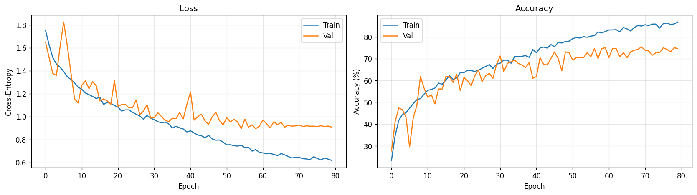

# lightweight speech emotion recognition on open datasets

[](https://github.com/elsayedelmandoh/lightweight-speech-emotion-recognition-on-open-datasets)
[](https://www.linkedin.com/in/elsayed-elmandoh)
[](https://www.linkedin.com/in/khaled-ahmed202/)
[](https://www.linkedin.com/in/salma-essam-atya/)
[]()
[](https://x.com/aangpy)


<figure align="center">
  
  <figcaption>cnn training/validation accuracy and loss over 80 epochs. early stopping triggered at epoch 67</figcaption>
</figure>


## table of contents

- [overview](#overview)
- [key features](#key-features)
- [project structure](#project-structure)
- [setup](#setup)
- [usage](#usage)
- [testing](#testing)
- [methodology](#methodology)
- [team](#team)
- [contributing](#contributing)
- [license](#license)
- [author](#author)


## overview

cisc-867 deep learning course project. speech emotion recognition (ser) on ravdess using a lightweight 1d cnn on log-mel-spectrograms, compared against a classical mfcc + svm baseline. optimized for cpu inference and cross-speaker generalization.

- **problem**: classify 6 shared acted emotions (neutral, calm, happy, sad, angry, fearful) from short (~4s) speech clips with a model small enough to run on a cpu laptop.
- **dataset**: ravdess (ryerson audio-visual database of emotional speech and song). 24 actors, 6 shared emotions (speech + song channels), 1628 train / 264 val / 176 test (speaker-disjoint: actors 1-19 / 20-22 / 23-24). 384 speech files for disgust/surprised dropped for 6-class compatibility.
- **main model**: 1d cnn on 128-band log-mel-spectrograms, ~150k parameters, < 1 ms/sample cpu latency.
- **baseline**: mfcc (240-dim: mean/std of mfcc + delta + delta-delta) + gridsearched svm.
- **comparison axes**: test accuracy, model size, cpu inference latency.


## key features

- **lightweight cnn**: 3 conv1d blocks + adaptive avg pool, ~150k params, fits in <600 kb on disk.
- **cpu-optimized**: per-sample inference < 1 ms on a modern laptop cpu.
- **speaker-disjoint split**: actors 1-19 train, 20-22 val, 23-24 test, ensures cross-speaker generalization is measured.
- **two pipelines in one repo**: classical mfcc + svm baseline and 1d cnn on mel, side-by-side in 08.
- **reproducible**: fixed splits, seed=42 (via `src/config/config.py` SEED), all hyperparameters in `src/config/config.py`.
- **augmentation**: optional specaugment (time and frequency masking) for cnn training.


## project structure

```
lightweight speech emotion recognition on open datasets/
|
├── data/
│   ├── raw/                        # original ravdess audio
│   ├── processed/                  # X_{train,val,test}_{mel,mfcc}.npy, y_*.npy
│   ├── models/                     # svm_best.pkl, cnn1d_best.pth, cnn1d_meta.json
│   ├── predictions/                # comparison_results.json
│   └── samples/                    # small test samples
|
├── docs/
│   ├── 01-project-definition/      # problem, scope, deliverables
│   ├── 02-results/
│   └── 03-deliverables/            # midterm/final report, presentation
|   
├── notebooks/                      # sequential, run in order
│   ├── 00-preliminary-experiments/00-quickstart.ipynb
│   │   ├── artifacts/
│   │   ├── 00-quickstart.ipynb
│   │   ├── 01-data-acquisition.ipynb
│   │   ├── 02-eda.ipynb
│   │   ├── 03-data-preprocessing.ipynb
│   │   ├── 04-feature-engineering.ipynb
│   │   ├── 05-model-training.ipynb
│   │   ├── 06-model-evaluation.ipynb
│   │   └── 07-model-testing.ipynb
|   |
│   ├── 01-data-acquisition/
│   │   ├── 00-quickstart.ipynb
│   │   └──01-data-acquisition.ipynb
|   |
│   ├── 02-eda/
│   │   ├── 00-quickstart.ipynb
│   │   └──02-eda.ipynb
|   |
│   ├── 03-data-preprocessing/
│   │   ├── 00-quickstart.ipynb
│   │   └──03-data-preprocessing.ipynb
|   |
│   ├── 04-feature-engineering/
│   │   ├── 00-quickstart.ipynb
│   │   └──04-feature-engineering.ipynb
|   |
│   ├── 05-model-training/
│   │   ├── 00-quickstart.ipynb
│   │   ├── 05.1-svm-baseline.ipynb
│   │   └── 05.2-cnn-1d.ipynb
|   |
│   ├── 06-model-evaluation/
│   │   ├── 00-quickstart.ipynb
│   │   ├── 06.1-svm-baseline.ipynb
│   │   └── 06.2-cnn-1d.ipynb
|   |
│   ├── 07-model-testing/
│   │   ├── 00-quickstart.ipynb
│   │   ├── 07.1-svm-baseline.ipynb
│   │   └── 07.2-cnn-1d.ipynb
|   |
│   ├── 08-comparision/
│   │   ├── 00-quickstart.ipynb
│   │   └── 08-svm-vs-cnn.ipynb
|   |
│   └── 09-additional-results/
│       ├── 00-quickstart.ipynb
│       ├── Wav2Vec2-panns-cnn-2d.ipynb
│       └── README.md
|   
├── src/
│   ├── config/               
│   │   └── config.py               # typed settings (hyperparameters, paths)
|   |
│   ├── utils/
│   │   ├── data_acquisition.py     
│   │   ├── data_preprocessing.py    
│   │   ├── eda.py                  
│   │   └── feature_engineering.py  # extract_mel, extract_mfcc, augmentation
|   |
│   ├── models/
│   │   ├── cnn1d_model.py          # LightweightCNN1D, train_cnn, predict_cnn, load_cnn
│   │   └── svm_model.py            # train_svm, predict_svm, load_svm
|   |
│   └── setup.py                    # ensure_directories()
|   
├── tests/                          # pytest
|       └── test_smoke.py    
|
├── app.py                          # entrypoint (stub)
├── pyproject.toml                  # python 3.12, pytest config
├── requirements.txt
├── README.md
├── LICENSE
├── .gitignore
└── .env.example       
```


## setup

prerequisites:

- [git](https://git-scm.com/)
- [anaconda](https://www.anaconda.com/) or miniconda
- python 3.12

```bash
# create and activate environment
conda create -n envname python=3.12 -y
conda activate envname

# install dependencies
conda install pip -y
pip install -r requirements.txt

# environment variables
cp .env.example .env   
```


## usage

run notebooks in numerical order (00 -> 08):

```bash
jupyter notebook
```

or run individual stages:

```bash
# 1. acquire and preprocess ravdess (notebooks 01-03)
# 2. extract features (notebook 04): mel (128x251) and mfcc (240)
# 3. train models (notebooks 05.1, 05.2): svm and 1d cnn
# 4. evaluate on val set (notebooks 06.1, 06.2)
# 5. test on held-out actors 23-24 (notebooks 07.1, 07.2)
# 6. compare models (notebook 08)
```

expected outputs after a full run:

- `data/processed/X_{train,val,test}_mel.npy`   (n, 128, 251)  float32
- `data/processed/X_{train,val,test}_mfcc.npy`  (n, 240)        float32
- `data/models/svm_best.pkl`        svm with probability=True
- `data/models/mfcc_scaler.pkl`     standard scaler for mfcc features
- `data/models/cnn1d_best.pth`      1d cnn state dict
- `data/models/cnn1d_meta.json`     train history, val acc, latency stats
- `data/predictions/comparison_results.json`  side-by-side metrics


## testing

```bash
pytest
```

configured via `pyproject.toml` (testpaths: `tests/`, pythonpath includes `.`).


## methodology

**preprocessing**: 16 khz mono audio, 4s clips, log-mel-spectrogram with 128 mel bands and 251 time frames, per-sample zero-mean unit-std normalization for cnn. mfcc with 40 coefficients, plus delta and delta-delta, mean and std pooled (240-dim vector) for svm.

**speaker-disjoint split**: actors 1-19 (1628 samples) for training, 20-22 (264) for validation, 23-24 (176) for test. no speaker overlap between splits.

**1d cnn architecture** (lightweight, cpu-friendly):

```
input (128, 251) log-mel
  -> conv1d(128->64, k=5) + batchnorm + relu + maxpool(2)
  -> conv1d(64->128, k=5) + batchnorm + relu + maxpool(2)
  -> conv1d(128->128, k=3) + batchnorm + relu + adaptiveavgpool(1)
  -> dropout(0.3)
  -> linear(128, 6)
```

~150k parameters, <600 kb on disk.

**training**: adamw (lr=1e-3, weight_decay=1e-4), onecyclelr (max_lr=3e-3), label smoothing 0.1, specaugment (time mask=30, freq mask=12, n=2), early stopping on val acc with patience 20.

**svm baseline**: standard scaler on 240-dim mfcc, gridsearched rbf (c in {0.1, 1}), linear (c in {0.1, 1, 10}), and polynomial (degree 2, c in {1, 10}) kernels, `probability=true`.


## team

### members
- **elsayed elmandoh**
- **khaled ashoush**
- **salma essam**

### code responsibilities (notebooks)

| notebook | elsayed | khaled | salma |
|----------|---------|--------|-------|
| 00-preliminary-experiments | primary | primary | primary |
| 01 data acquisition | -- | primary | -- |
| 02 eda | -- | primary | primary |
| 03 preprocessing | -- | primary | primary |
| 04 feature engineering | -- | primary | primary |
| 05.1 svm baseline | primary | -- | primary |
| 05.2 cnn 1d | primary | -- | -- |
| 06.1 svm evaluation | primary | primary | -- |
| 06.2 cnn evaluation | primary | -- | primary |
| 07.1 svm testing | primary | primary | -- |
| 07.2 cnn testing | primary | -- | primary |
| 08 comparison | primary | primary | primary |

### report & presentation

| deliverable | contributors |
|-------------|--------------|
| midterm report | elsayed, salma, khaled |
| final report | elsayed, salma, khaled |
| presentation script | elsayed, salma, khaled |
| presentation slides | salma |

### workflow

- all three members contribute to the full pipeline, code reviews, pull requests, and discussion are shared
- reports are joint efforts: all team members contribute to the draft, then we all review and edit
- presentation script is written collaboratively, salma builds the slides from the agreed script

# Future Work

## Model Categories

### 1. Classical Machine Learning
| Model | Description |
|-------|-------------|
| **Support Vector Machine (SVM)** | Traditional ML baseline using MFCC features with RBF kernel and GridSearchCV optimization |

### 2. Deep Learning (1D)
| Model | Description |
|-------|-------------|
| **CNN1D + Attention + BiLSTM** | One-dimensional convolutional neural network with attention mechanism and bidirectional LSTM for temporal feature extraction |

### 3. Deep Learning (2D)
| Model | Description |
|-------|-------------|
| **CNN2D + Attention + BiLSTM** | Two-dimensional convolutional neural network with attention mechanism and bidirectional LSTM for spectrogram-based feature learning |

### 4. Transfer Learning
| Model | Description |
|-------|-------------|
| **PANNs CNN14** | Pretrained audio neural network from the PANNs (Pretrained Audio Neural Networks) family, fine-tuned for emotion recognition |

### 5. Self-Supervised Learning
| Model | Description |
|-------|-------------|
| **Wav2Vec2 Base** | Facebook's wav2vec2.0 model leveraging self-supervised pretraining on large speech corpora, adapted for emotion classification |

## contributing

contributions are welcome. to propose a change:

- fork the repository.
- create a branch for your change.
- make changes, commit with clear messages.
- push to your fork and open a pull request.


## license

course project. ravdess is licensed cc by 4.0.

### citing ravdess

the ravdess dataset is released under a creative commons attribution license. please cite the ravdess if it is used in your work in any form. published academic papers should use the academic paper citation. personal works, such as machine learning projects or blog posts, should provide a url to the zenodo page, though a reference to the plos one paper would also be appreciated.

**academic paper citation**

livingstone sr, russo fa (2018) the ryerson audio-visual database of emotional speech and song (ravdess): a dynamic, multimodal set of facial and vocal expressions in north american english. plos one 13(5): e0196391. https://doi.org/10.1371/journal.pone.0196391

**personal use citation**

include a link to the zenodo page: https://zenodo.org/record/1188976


## author

developed by 

- elsayed elmandoh - nlp engineer - [linkedin](https://www.linkedin.com/in/elsayed-elmandoh)
- khaled ahmed - data scientist & ml - [linkedin](https://www.linkedin.com/in/khaled-ahmed202/)
- salma abdelfattah - ai software engineer - [linkedin](https://www.linkedin.com/in/salma-essam-atya/)
