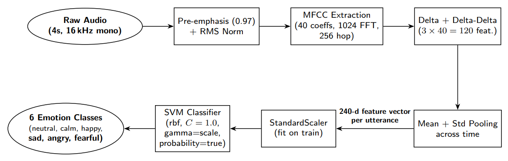
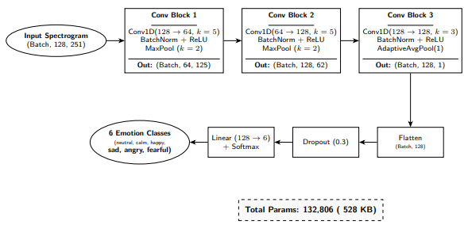

## 4. methodology

### 4.1 classical baseline: mfcc + svm

we standardize the 240-dimensional mfcc feature vector (per the preprocessing in section 3) using scikit-learn's `standardscaler` fitted on the training set. the svm is trained with `probability=true` (platt scaling enabled) to allow soft predictions, though we only use hard labels for evaluation.

**hyperparameter grid search.** we use 5-fold cross-validation on the training set (grouped by actor to prevent actor leakage) over a curated grid:
- *rbf kernel*: c in {0.1, 1}, gamma in {0.001, 0.005, 0.01, "scale"}  (8 combos)
- *linear kernel*: c in {0.1, 1, 10}  (3 combos)
- *polynomial kernel*: degree 2, c in {1, 10}, gamma in {"scale", 0.01}  (4 combos)

total: 15 hyperparameter combinations x 5 folds = 75 svm fits. the best model is selected by mean cross-validation accuracy. the initial grid (before regularization analysis) included rbf c in {0.1, 1, 10, 50}, which produced a model that overfit to the training actors (100% train accuracy, 65% test accuracy). capping c at 1 reduced the gap to 24pp and improved test accuracy to 70.45%.



the final svm is: rbf kernel, c=1.0, gamma="scale", probability=true. training takes ~2 minutes on cpu.

### 4.2 deep model: lightweight 1d cnn

**architecture.** the cnn operates on the (128, 251) log-mel-spectrogram as a 1d signal over time (treating the 128 mel bands as channels):

```
input: (batch, 128, 251)  [128 mel bands, 251 time frames]
  -> conv1d(in=128, out=64, kernel=5) + batchnorm + relu + maxpool(2)
  -> conv1d(in=64, out=128, kernel=5) + batchnorm + relu + maxpool(2)
  -> conv1d(in=128, out=128, kernel=3) + batchnorm + relu + adaptiveavgpool(1)
  -> dropout(0.3)
  -> linear(128, 6)
```

the model has **132,806 parameters** (~528 kb on disk, well under 1 mb). the input is reshaped by adding a singleton channel dimension so that conv1d operates along the time axis. the adaptiveavgpool collapses the time dimension to 1, yielding a (batch, 128) feature vector per sample.

**training.**
- *loss*: cross-entropy with label smoothing 0.05
- *optimizer*: adamw (lr=1e-3, weight_decay=5e-4)
- *scheduler*: onecyclelr (max_lr=3e-3, 5-epoch warmup)
- *batch size*: 32
- *epochs*: 80 (with early stopping, patience 20 on val accuracy)
- *augmentation*: specaugment (time mask=30, freq mask=12, n=2)
- *device*: cpu (no gpu assumed per project constraints)



training takes ~15 minutes per epoch on a modern cpu laptop.

### 4.3 evaluation protocol

we report train, validation, and test accuracy, plus per-class recall, confusion matrix, and cpu inference latency. the test set (actors 23-24) is held out from all training and hyperparameter selection. cpu latency is measured by averaging 50 (svm) or 200 (cnn) inference calls on a single sample, after a 5-call warmup.

### 4.4 ablations

- *svm c-cap*: full grid (c in {0.1, 1, 10, 50}) vs. capped grid (c in {0.1, 1}). the cap reduces overfitting and improves test accuracy.
- *svm kernel comparison*: rbf vs. linear vs. polynomial degree 2. rbf wins on this dataset; linear underfits.
- *specaugment*: with vs. without (and with stronger masks time=50, freq=18). the original (30, 12) is the best balance.
