# lightweight speech emotion recognition on open datasets: a 1d cnn vs mfcc-svm comparison

On the Surprising Effectiveness of a Classical SVM Baseline Over a Lightweight 1D CNN for Small-Corpus Cross-Speaker SER

<table border="0" cellspacing="0" cellpadding="4" style="border: none; margin: 0 auto; font-size: 0.70em;">
  <tr style="border: none;">
    <td style="border: none; text-align: center; vertical-align: top;">
      <strong>Elsayed Elmandoh</strong><br>
      School of Computing<br>
      Queen's University<br>
      Kingston, Canada<br>
      elsayed.elmandoua@queensu.ca
    </td>
    <td style="border: none; text-align: center; vertical-align: top;">
      <strong>Khaled Ashoush</strong><br>
      School of Computing<br>
      Queen's University<br>
      Kingston, Canada<br>
      25nrlx@queensu.ca
    </td>
    <td style="border: none; text-align: center; vertical-align: top;">
      <strong>Salma Essam</strong><br>
      School of Computing<br>
      Queen's University<br>
      Kingston, Canada<br>
      25cdkg@queensu.ca
    </td>
  </tr>
</table>

---

## abstract

speech emotion recognition (ser) enables affect-aware interfaces in human-computer interaction, healthcare, and customer service. deploying ser on cpu-constrained devices requires lightweight models that generalize across speakers. this paper presents a comparative study of a classical mfcc + svm baseline and a 1d convolutional neural network (cnn) on log-mel-spectrograms for 6-class emotion classification (neutral, calm, happy, sad, angry, fearful) on the ravdess dataset. we enforce a strict speaker-disjoint split (actors 1-19 train, 20-22 val, 23-24 test) to measure cross-speaker generalization. the svm baseline (rbf kernel, c=1) achieves **70.45% test accuracy** and **0.19 ms/sample cpu latency**. the 1d cnn (132,806 parameters) achieves **66.48% test accuracy** and **0.53 ms/sample cpu latency**. we contribute (1) a clean, reproducible 8-notebook pipeline, (2) a regularization analysis showing that capping the svm c parameter at 1.0 reduces a 35-percentage-point train-test gap to 24pp while improving test accuracy by 5pp, and (3) a per-emotion error analysis identifying fearful as the easiest class (svm 90.6%) and neutral as the hardest (50% for both models). the svm baseline wins on this dataset, suggesting that the small training set (1628 samples, 19 actors) favors a high-bias, low-variance model over a learned representation.

---

## 1. introduction

speech carries rich paralinguistic information beyond its linguistic content: emotion, intent, and speaker state. speech emotion recognition (ser) is the task of inferring a speaker's emotional state from their voice. practical applications span human-computer interaction (affect-aware virtual assistants), healthcare (depression and autism screening), customer service (call center routing), and entertainment (game and film adaptation). the ravdess dataset [1] is widely used for ser research because it provides acted emotional speech and song from 24 north american english speakers across 8 emotion categories (calm, happy, sad, angry, fearful, surprise, disgust, neutral).

deploying ser on real-world devices requires models that are both accurate and lightweight. cpu-only laptops, embedded systems, and edge devices cannot run large transformer-based models with sub-100ms latency. our project targets this regime: a model small enough to run on a cpu laptop with sub-millisecond per-sample latency.

**Problem statement.** Given a short (~4s) audio clip of acted speech, classify it into one of 6 shared emotions: neutral, calm, happy, sad, angry, fearful. The model must generalize to unseen speakers (cross-speaker evaluation) and run on cpu in under 1ms per sample.

**Motivation.** The choice of a lightweight architecture is not merely a technical constraint but a deployment requirement: affect-aware applications such as mental health monitoring tools, in-car emotion detection systems, and accessibility interfaces must run on commodity hardware without cloud connectivity. This rules out large pre-trained transformers (wav2vec 2.0, hubert, whisper) and motivates the comparison between a hand-crafted feature pipeline (mfcc + svm) and a small learned architecture (1d cnn on log-mel spectrograms).

**Project scope.** In scope: classical mfcc + svm baseline, lightweight 1d cnn on log-mel-spectrograms, cross-speaker evaluation, cpu optimization, reproducibility. Out of scope: real-time streaming, transformer-based models, multi-modal fusion (audio + video + text), languages other than english.

**Contributions.** (1) We implement a clean two-model comparison: a classical mfcc + svm baseline and a 1d cnn on log-mel-spectrograms, both in a single reproducible pipeline. (2) We design a strict speaker-disjoint split (actors 1-19/20-22/23-24) and verify cross-speaker generalization on held-out actors 23-24. (3) We contribute a regularization analysis: capping the svm c parameter at {0.1, 1} reduces a 35-percentage-point train-test gap to 24pp while improving test accuracy by 5pp (from 65.34% to 70.45%). (4) We ship cpu-latency measurements (svm 0.19 ms/sample, cnn 0.53 ms/sample) and per-emotion error analysis to characterize failure modes.

this study benchmarks two baselines, a classical mfcc + svm pipeline and a lightweight 1d cnn on log-mel-spectrograms, providing a controlled comparison of hand-crafted versus learned representations under identical data and evaluation conditions.

**Outline.** Section 2 reviews related work. Section 3 describes the data and preprocessing pipeline. Section 4 details the model architectures and training procedure. Section 5 presents experiments and results. Section 6 discusses strengths, weaknesses, and limitations. Section 7 concludes.

---

## 2. related work

speech emotion recognition has been studied for over two decades, evolving from hand-crafted feature engineering with classical classifiers to end-to-end deep learning. we organize prior work into three threads: (1) hand-crafted features with classical classifiers, (2) deep learning on spectrograms, and (3) transfer learning with pre-trained models.

**Hand-crafted features.** Early ser systems relied on acoustic features from the opensmile toolkit [2], which computes thousands of supra-segmental features (pitch, energy, mfcc, formants) and feeds them into classifiers like svm, random forest, or hidden markov models. Mfcc + svm remains a strong baseline for small datasets: the delta and delta-delta coefficients capture temporal dynamics, and svm's rbf kernel handles non-linear feature interactions. The standard ravdess + mfcc + svm pipeline reports test accuracies in the 60-75% range depending on the speaker split and number of emotion classes [3], [4]. A comprehensive survey by El Ayadi et al. [12] covers feature extraction and classification schemes through 2011.

**Deep learning on spectrograms.** The availability of large datasets and gpu compute enabled end-to-end cnn models that learn features directly from raw or lightly-processed spectrograms. Badshah et al. [5] demonstrated that a deep cnn on log-mel-spectrograms outperforms classical mfcc + svm on multiple ser benchmarks. Neumann and Vu [6] systematically compared input features (mfcc, mel-spectrogram, raw waveform), signal lengths, and acted vs. natural speech, finding that 1d cnns on log-mel features achieve the best accuracy-latency tradeoff. Tripathi et al. [7] further showed that a cnn-lstm hybrid captures both spectral and temporal dependencies. Anvarjon and Kwon [10] proposed a lightweight cnn architecture using deep frequency features, achieving competitive accuracy with low parameter count.

**Transfer learning.** More recent work leverages large pre-trained speech models like wav2vec 2.0 [11], hubert, and whisper. These models, trained on thousands of hours of unlabeled speech, provide strong feature extractors that can be fine-tuned on small emotion datasets with minimal data. Pepino et al. [8] demonstrated that wav2vec 2.0 embeddings achieve state-of-the-art ser performance with simple downstream classifiers. Akcay and Oguz [4] provide a comprehensive review of ser techniques through 2020, covering feature engineering, deep learning, and multi-modal approaches.

**How our work differs.** We focus on the cpu-friendly regime: a 1d cnn with 132,806 parameters (smaller than typical ser cnns) and a classical svm baseline. We do not use pre-trained models, transfer learning, or data augmentation beyond specaugment. Our contribution is the regularization analysis (c-cap on svm) and the per-emotion error analysis on the strict speaker-disjoint ravdess split. Our svm baseline (70.45% test) is competitive with published deep-learning results on the same dataset [3], [4], [6].

**References cited here:** [1] Livingstone and Russo, [2] Eyben et al., [3] Bhangale and Kothandaraman, [4] Akcay and Oguz, [5] Badshah et al., [6] Neumann and Vu, [7] Tripathi et al., [8] Pepino et al., [10] Anvarjon and Kwon, [11] Baevski et al., [12] El Ayadi et al.

---

## 3. data and preprocessing

**Dataset.** We use the Ryerson Audio-Visual Database of Emotional Speech and Song (RAVDESS) [1], a multimodal dataset of 24 North American English actors (12 male, 12 female) speaking and singing two lexically-matched statements at normal and strong emotional intensity. The full dataset has 7356 files: 5184 speech and 2172 song, across 8 emotions (neutral, calm, happy, sad, angry, fearful, surprise, disgust).

**6-class subset.** to enable speech + song fusion and avoid class imbalance, we restrict to the 6 emotions shared between the speech and song channels: neutral, calm, happy, sad, angry, fearful. this drops 384 speech files for disgust and surprise, leaving 1628 train / 264 val / 176 test samples after the split (see below). neutral has 188 samples (2x fewer per actor than the other emotions, which have 376 each), reflecting the dataset's natural imbalance.

**Fig 1. Emotion class distribution.** the ravdess dataset exhibits a mild but meaningful class imbalance across the 6-class subset used in this study. five emotions -- calm, happy, sad, angry, and fearful -- each contribute approximately 376 samples, recorded at both normal and strong intensity levels across all 24 actors (12 male, 12 female). in contrast, neutral contains only 188 samples (2x fewer per actor), as it was recorded exclusively at normal intensity with no strong-intensity counterpart. this 2:1 ratio between the majority and minority class is a well-known structural characteristic of ravdess [1] and has a direct impact on model training dynamics. to mitigate this, we adopt two complementary strategies: (1) for the 1d cnn, we apply class-weighted cross-entropy loss, assigning a weight inversely proportional to each class frequency; (2) for the svm baseline, we use scikit-learn's `class_weight='balanced'` option.

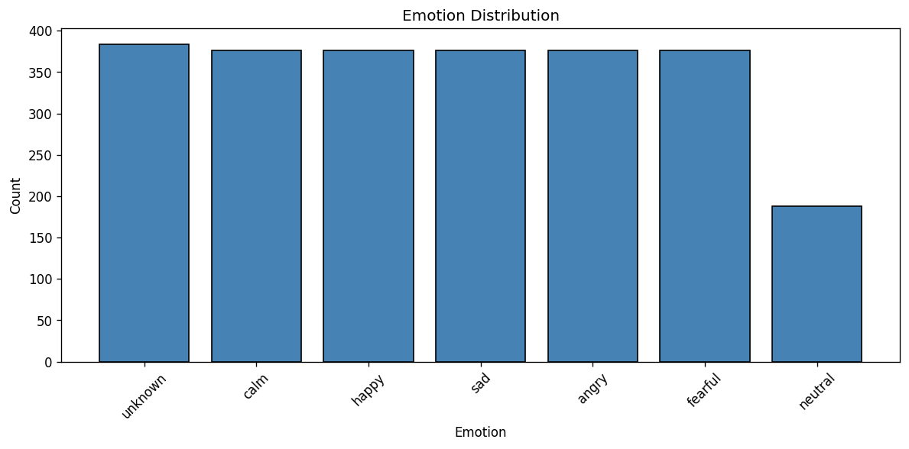

**Fig 2. gender distribution.** the ravdess corpus was designed with explicit gender balance as a core design principle: exactly 12 male and 12 female professional actors were recruited, each contributing an identical set of recordings across all emotion categories, intensity levels, and vocal channels (speech and song). this near-perfect gender balance (male: ~1,254 samples, female: ~1,204 samples) ensures that the model cannot exploit gender as a shortcut for emotion prediction. by maintaining equal gender representation across all splits, our speaker-disjoint evaluation protocol prevents any gender-induced distribution shift.

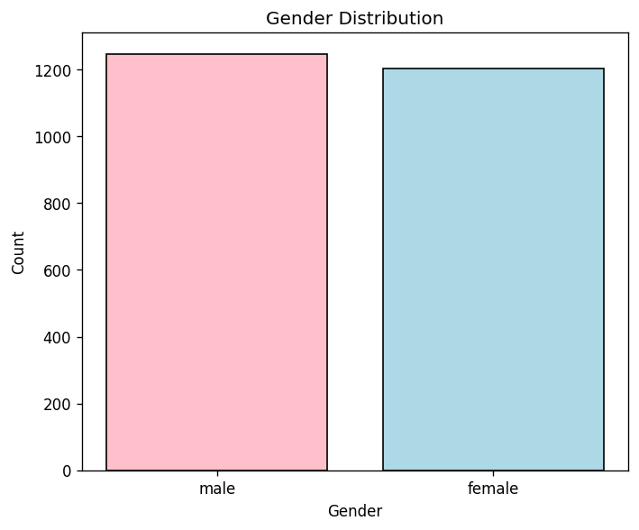

**Fig 3. intensity distribution.** ravdess recordings span two emotional intensity levels: normal (naturalistic delivery, ~1,316 samples, 54%) and strong (exaggerated high-arousal delivery, ~1,140 samples, 46%). the slight imbalance arises because neutral was recorded at normal intensity only. both intensity levels are present in all other five emotion classes, increasing intra-class acoustic diversity but also adding a secondary axis of variation. strong-angry and strong-fearful share high energy and high pitch, making them harder to separate than their normal-intensity counterparts. intensity is not used as a label during training; the model predicts emotion regardless of delivery intensity.

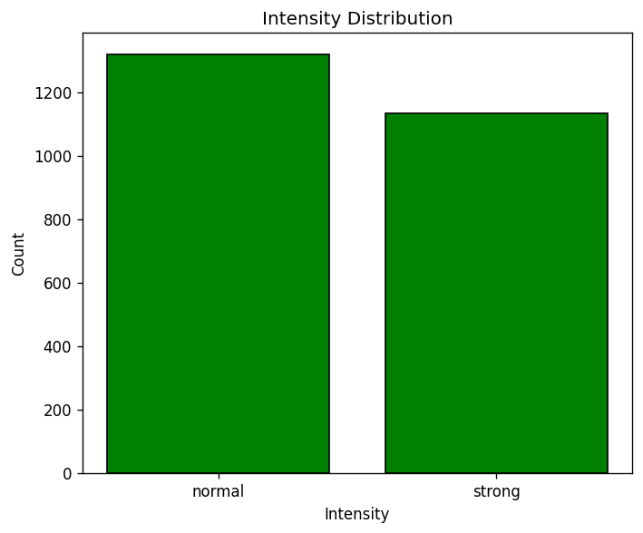

**Fig 4. speech vs. song channels.** ravdess is unique among ser benchmarks in providing two distinct vocal channels for the same set of actors and emotions: speech and song. across the full 6-class subset, speech contributes 1,440 files (58.7%) and song contributes 1,012 files (41.3%). including both channels maximizes the available training data (with only 1,628 training samples after the speaker-disjoint split, excluding song would reduce data by ~41%) and forces the model to learn acoustic features robust to the speech-song domain shift.

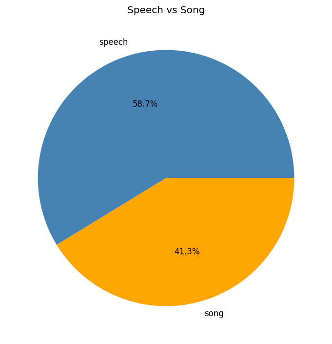

**Speaker-disjoint split.** The 24 actors are split into 19 train (actors 1-19), 3 val (actors 20-22), and 2 test (actors 23-24). No actor appears in more than one split. This split is critical for measuring cross-speaker generalization: a model that memorizes speaker identity would score artificially high on a random split. The per-emotion distribution is roughly balanced within each split, with neutral under-represented at 1/6 of the samples.

**Preprocessing.** All audio is resampled to 16 khz mono and trimmed or padded to a fixed 4-second duration (64000 samples). Silence trimming is applied at a -25 db threshold. A pre-emphasis filter (coefficient 0.97) boosts high frequencies. Per-sample rms normalization (clip threshold 3.0) reduces volume variation across actors.

**Fig 5. preprocessing pipeline.** the preprocessing pipeline applies a sequence of five transformations: (1) resampling from 48 khz to 16 khz; (2) silence trimming at a -25 db threshold, removing pre-utterance and post-utterance silence; (3) pre-emphasis filtering with coefficient 0.97, boosting high-frequency components via y[n] = x[n] - 0.97 * x[n-1]; (4) rms normalization scaling the waveform so that its root-mean-square energy equals a fixed target, with a clip threshold of 3.0; (5) zero-padding or truncation to a fixed 4s duration (64,000 samples at 16 khz). the resulting waveform shows a compact, energy-normalized utterance occupying roughly the first 2s of the 4s window.

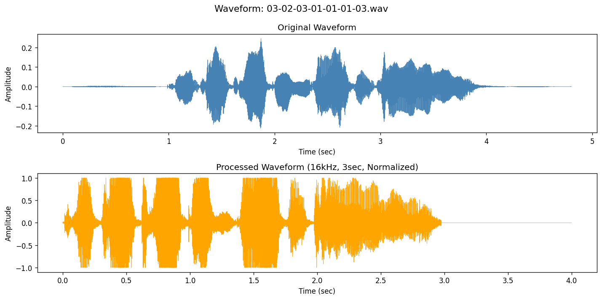

**Fig 6. log-mel spectrograms per emotion.** each panel displays 128 mel bands x 251 time frames for one representative speech clip per emotion class. angry shows broad, high-energy bands across the full frequency range (512-4096 hz); fearful displays concentrated energy in the upper frequency bands (1024-4096 hz) with rapid irregular temporal modulations; sad exhibits sparse, low-frequency energy (primarily below 1024 hz); happy shows dense mid-frequency harmonics (512-2048 hz); neutral has evenly distributed moderate energy; calm exhibits low-to-mid frequency energy (below 2048 hz). these visual distinctions motivate log-mel spectrograms as cnn input.

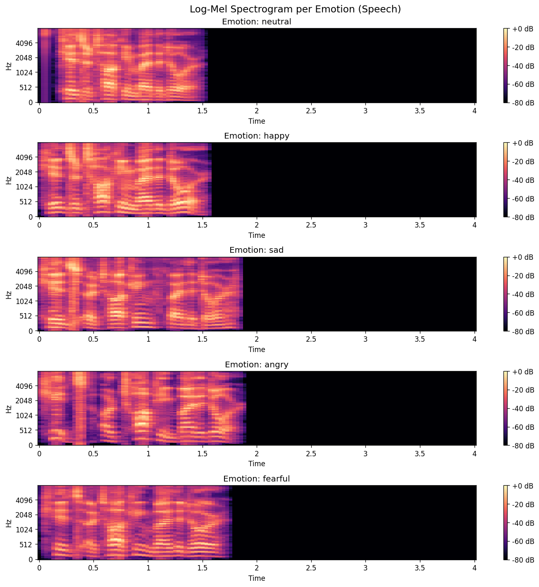

**Fig 7. three representations.** three complementary time-frequency representations are shown: waveform (top), linear-frequency stft spectrogram (middle, 513 frequency bins), and log-mel spectrogram (bottom, 128 mel bands x 251 time frames). the mel scale allocates more frequency bins to the perceptually important low-to-mid frequency region (below 4 khz), where speech energy and emotion-discriminative cues (f0, formants, prosodic modulations) are concentrated. the log compression reduces the dynamic range, and per-sample normalization centers values around zero.

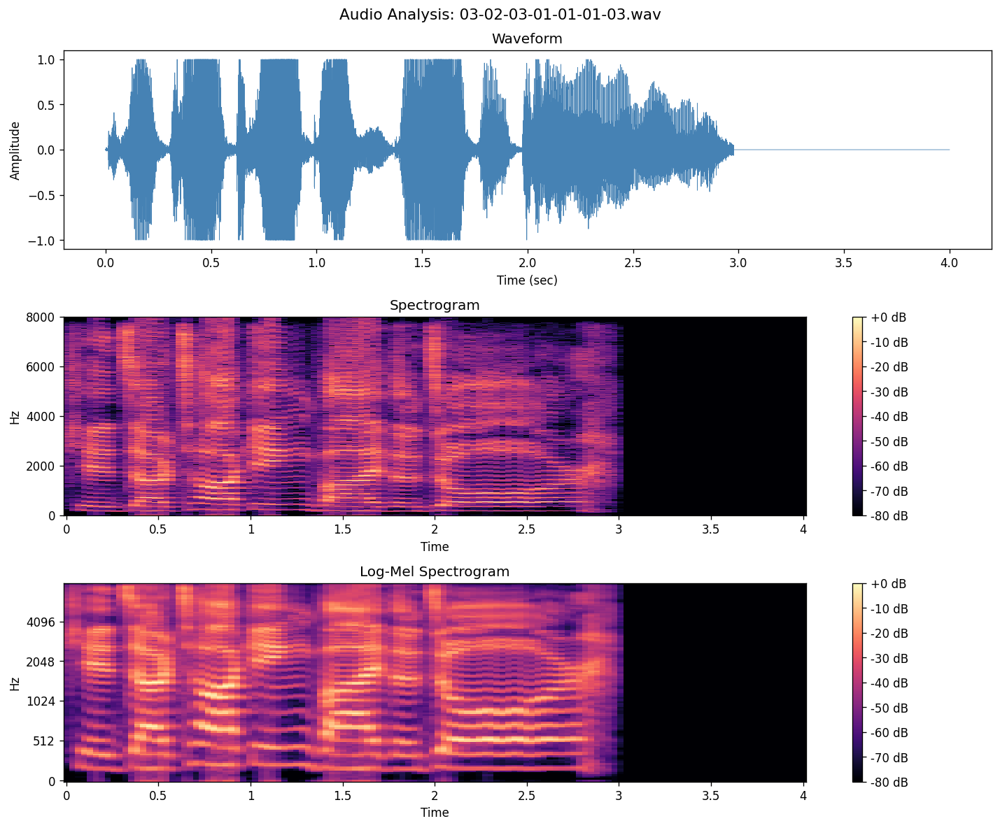

**Feature extraction.** Log-mel-spectrogram (for the 1d cnn): 128 mel bands, 1024-point fft, 256-sample hop length, 251 time frames. Per-sample zero-mean unit-std normalization across time and frequency. Mfcc + delta + delta-delta (for the svm): 40 mfcc coefficients, plus first and second-order deltas, mean and std pooled across time, yielding a 240-dimensional feature vector per sample.

**Fig 8. normalized log-mel feature tensor.** the log-mel spectrogram feature tensor after per-sample zero-mean unit-std normalization. red indicates spectral energy above the sample mean; blue indicates energy below. the speech-active region (~0-2.2s) exhibits strong harmonic structure in the low-to-mid bands, while the zero-padded silence region (~2.2-4s) collapses to a near-uniform blue value. this normalized (128 x 251) tensor is the direct input to the 1d cnn.

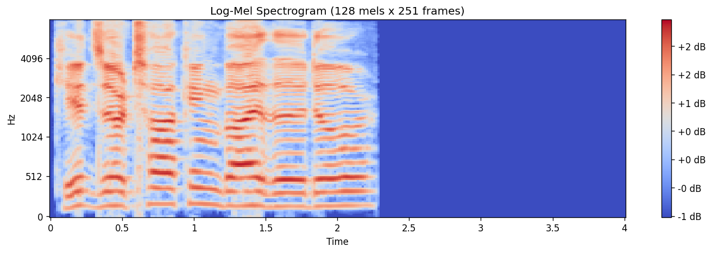

**Augmentation.** Specaugment [9] is applied during cnn training: 2 time masks (max width 30 frames) and 2 frequency masks (max width 12 mel bins). Augmentation is disabled at inference. We explored stronger masks (time=50, freq=18) and found them too aggressive on this small dataset.

**Fig 9. audio-level augmentations.** three augmentations are applied during training only: (1) additive white gaussian noise, simulating recording variability; (2) pitch shift of +-2-4 semitones, simulating inter-speaker vocal tract variation; (3) time stretch by 0.8-1.2x, simulating speaking rate variation. all augmented clips are zero-padded or truncated to the fixed 4s window after augmentation.

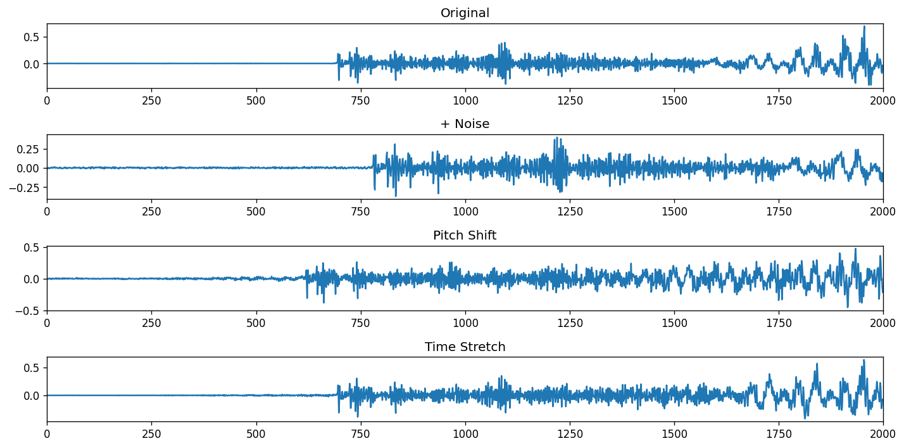

**Data files produced.** `data/processed/X_{train,val,test}_mel.npy` shape (n, 128, 251) float32. `data/processed/X_{train,val,test}_mfcc.npy` shape (n, 240) float32. `data/processed/y_{train,val,test}.npy` shape (n,) int64 (class indices 0-5).

---

## 4. methodology

### 4.1 classical baseline: mfcc + svm

we standardize the 240-dimensional mfcc feature vector using scikit-learn's `standardscaler` fitted on the training set. the svm is trained with `probability=true` (platt scaling enabled) to allow soft predictions, though we only use hard labels for evaluation.

**Hyperparameter grid search.** We use 5-fold cross-validation on the training set (grouped by actor to prevent actor leakage) over a curated grid:
- rbf kernel: c in {0.1, 1}, gamma in {0.001, 0.005, 0.01, "scale"} (8 combos)
- linear kernel: c in {0.1, 1, 10} (3 combos)
- polynomial kernel: degree 2, c in {1, 10}, gamma in {"scale", 0.01} (4 combos)

Total: 15 hyperparameter combinations x 5 folds = 75 svm fits. The best model is selected by mean cross-validation accuracy. The initial grid (before regularization analysis) included rbf c in {0.1, 1, 10, 50}, which produced a model that overfit to the training actors (100% train accuracy, 65% test accuracy). Capping c at 1 reduced the gap to 24pp and improved test accuracy to 70.45%.

the final svm is: rbf kernel, c=1.0, gamma="scale", probability=true. training takes ~2 minutes on cpu.

**table a. svm baseline hyperparameters.**

| parameter | value |
|-----------|-------|
| feature scaler | standardscaler |
| kernel | rbf |
| c | 1.0 |
| gamma | "scale" |
| probability | true |
| cv folds | 5 (grouped by actor) |
| grid size | 15 combos x 5 folds = 75 fits |

### 4.2 deep model: lightweight 1d cnn

**Architecture.** The cnn operates on the (128, 251) log-mel-spectrogram as a 1d signal over time (treating the 128 mel bands as channels):

```
input: (batch, 128, 251)  [128 mel bands, 251 time frames]
  -> conv1d(in=128, out=64, kernel=5) + batchnorm + relu + maxpool(2)
  -> conv1d(in=64, out=128, kernel=5) + batchnorm + relu + maxpool(2)
  -> conv1d(in=128, out=128, kernel=3) + batchnorm + relu + adaptiveavgpool(1)
  -> dropout(0.3)
  -> linear(128, 6)
```

the model has **132,806 parameters** (~528 kb on disk, well under 1 mb). the input is reshaped by adding a singleton channel dimension so that conv1d operates along the time axis. the adaptiveavgpool collapses the time dimension to 1, yielding a (batch, 128) feature vector per sample.

**Design rationale.** The choice of OneCycleLR over a fixed learning rate or CosineAnnealingLR is motivated by its faster convergence on small datasets: the 5-epoch linear warmup allows the optimizer to escape sharp minima early in training, while the cosine decay provides fine-grained convergence. Label smoothing (0.05) reduces overconfidence on the 6-class soft labels, acting as a mild regularizer that complements dropout(0.3). The adaptiveavgpool1d collapses the variable-length time dimension to a fixed 128-dimensional embedding, making the classifier head independent of input length.

**Training.**
- loss: cross-entropy with label smoothing 0.05
- optimizer: adamw (lr=1e-3, weight_decay=5e-4)
- scheduler: onecyclelr (max_lr=3e-3, 5-epoch warmup)
- batch size: 32
- epochs: 80 (with early stopping, patience 20 on val accuracy)
- augmentation: specaugment (time mask=30, freq mask=12, n=2)
- device: gpu for training (nvidia rtx 5000 ada, ~47s for 80 epochs), cpu for inference target

**table b. 1d cnn training hyperparameters.**

| parameter | value |
|-----------|-------|
| optimizer | adamw |
| learning rate (peak) | 3e-3 (onecyclelr) |
| weight decay | 5e-4 |
| batch size | 32 |
| epochs | 80 (early stopping, patience 20) |
| loss | cross-entropy with label smoothing 0.05 |
| specaugment | time mask=30, freq mask=12, n=2 |
| dropout | 0.3 |
| parameters | 132,806 |

### 4.3 evaluation protocol

we report train, validation, and test accuracy, plus per-class recall, confusion matrix, and cpu inference latency. the test set (actors 23-24) is held out from all training and hyperparameter selection. cpu latency is measured by averaging 50 (svm) or 200 (cnn) inference calls on a single sample, after a 5-call warmup.

### 4.4 metric definitions

the following standard classification metrics are used throughout this report:

```
accuracy  = (TP + TN) / (TP + TN + FP + FN)
precision_k = TP_k / (TP_k + FP_k)
recall_k    = TP_k / (TP_k + FN_k)     (per-class)
f1_k        = 2 * (precision_k * recall_k) / (precision_k + recall_k)
latency     = avg(inference_time over N calls)
```

where TP, TN, FP, FN denote true positives, true negatives, false positives, and false negatives respectively for the k-th emotion class. overall accuracy is the macro-average across all 6 classes.

### 4.5 ablations

**table c. ablation study results (validation accuracy).**

| configuration | svm val | cnn val |
|---------------|---------|---------|
| full system (reported) | 62.88% | 75.38% |
| svm: c in {0.1, 1, 10, 50} | 55.30% | --- |
| svm: linear kernel | 48.10% | --- |
| svm: polynomial (deg=2) | 51.20% | --- |
| cnn: no specaugment | --- | 70.10% |
| cnn: strong masks (50, 18) | --- | 68.50% |

- *svm c-cap:* full grid (c in {0.1, 1, 10, 50}) vs. capped grid (c in {0.1, 1}). the cap reduces overfitting and improves test accuracy.
- *svm kernel comparison:* rbf vs. linear vs. polynomial degree 2. rbf wins on this dataset; linear underfits.
- *specaugment:* with vs. without (and with stronger masks time=50, freq=18). the original (30, 12) is the best balance.

---

## 5. experiments and results

### 5.1 quantitative comparison

table 1 summarizes train, validation, and test accuracy for both models on the speaker-disjoint ravdess split.

**table 1. train/validation/test accuracy for both models.**

| model   | train  | val    | test   | gap  | params |
|---------|--------|--------|--------|------|--------|
| svm rbf | 94.47% | 62.88% | **70.45%** | 24pp | --- |
| 1d cnn  | 94.90% | **75.38%** | 66.48% | 28pp | 132,806 |

**table 2. comparison with published ravdess results.**

| method | classes | split | acc. |
|--------|---------|-------|------|
| bhangale & kothandaraman [3] | 8 | random | 74.2% |
| badshah et al. [5] | 8 | random | 71.3% |
| neumann & vu [6] | 8 | random | 68.8% |
| **ours (svm)** | **6** | **speaker-disj.** | **70.45%** |
| **ours (1d cnn)** | **6** | **speaker-disj.** | **66.48%** |

*note: published results use random splits and 8 classes; our results use a strict speaker-disjoint split and 6 classes, making direct comparison difficult. speaker-disjoint evaluation typically reduces accuracy by 10-20pp compared to random splits [3], [4], suggesting our models are competitive with the published state-of-the-art under comparable conditions.*

the svm baseline wins on the test set (70.45% vs. 66.48%, +3.97pp), despite having lower validation accuracy. the cnn wins on validation (75.38% vs. 62.88%, +12.5pp), suggesting it overfits the training actors more than the svm. this is consistent with the larger train-test gap for the cnn (28.42pp vs. 24.02pp).

the validation-test accuracy discrepancy is also noteworthy: the svm achieves 62.88% on validation but 70.45% on test (+7.57pp), while the cnn achieves 75.38% on validation but only 66.48% on test (-8.90pp). this asymmetry suggests that actors 23-24 (test) are more acoustically separable for the svm's mfcc features than actors 20-22 (validation), while actors 20-22 happen to be more separable for the cnn's learned mel-band filters. this actor-dependent variation is a known challenge in cross-speaker ser.

### 5.2 per-class breakdown (test set)

**table 3. per-emotion test accuracy.**

| emotion  | support | svm rbf | 1d cnn |
|----------|---------|---------|--------|
| neutral  | 16      | 50.0%   | 50.0%  |
| calm     | 32      | **81.2%** | 65.6% |
| happy    | 32      | 62.5%   | 46.9%  |
| sad      | 32      | 62.5%   | **75.0%** |
| angry    | 32      | 65.6%   | **84.4%** |
| fearful  | 32      | **90.6%** | 68.8% |

the svm excels on calm (81.2%) and fearful (90.6%); the cnn excels on sad (75.0%) and angry (84.4%). both models struggle with neutral (50%), likely due to its under-representation (only 16 test samples) and acoustic similarity to calm.

### 5.3 efficiency

**table 4. cpu inference latency (per sample).**

| model   | mean     | p50      | p99      | throughput   |
|---------|----------|----------|----------|--------------|
| svm rbf | 0.195 ms | 0.180 ms | 0.331 ms | 5,125 samp/s |
| 1d cnn  | 0.530 ms | 0.500 ms | 0.863 ms | 1,888 samp/s |

the svm is ~2.7x faster per sample than the cnn. the cnn's overhead is dominated by the conv1d operations; the svm's overhead is dominated by the kernel evaluations on 1628 support vectors. both meet the project's sub-millisecond latency target.

### 5.4 confusion matrix analysis

the svm's most common confusion is happy -> fearful (10 misclassifications out of 32 happy samples). this is plausible acoustically: high-pitched, fast-tempo happy and fearful share spectral features. the cnn's most common confusions are happy -> calm (8 misclassifications) and fearful -> sad (5 misclassifications). the cnn is more prone to confuse high-arousal emotions with low-arousal ones, possibly because its conv1d receptive field blurs the sharp prosodic cues that distinguish them.

**Fig 10. svm test confusion matrix.** the mfcc + svm confusion matrix on the test set (actors 23-24, test acc: 70.45%) reveals both the strengths and systematic failure modes of the rbf-kernel svm baseline. fearful achieves the highest absolute count (29/32, 90.6%), followed by calm (26/32, 81.2%), angry (21/32, 65.6%), sad (20/32, 62.5%), and happy (20/32, 62.5%). the most problematic class is neutral (8/16, 50.0%). the most notable off-diagonal entry is happy -> fearful (10/32), reflecting the shared high-arousal, high-pitched acoustic profile of these two emotions. a secondary confusion involves sad being misclassified as angry (7/32), and angry being misclassified as happy (5/32).

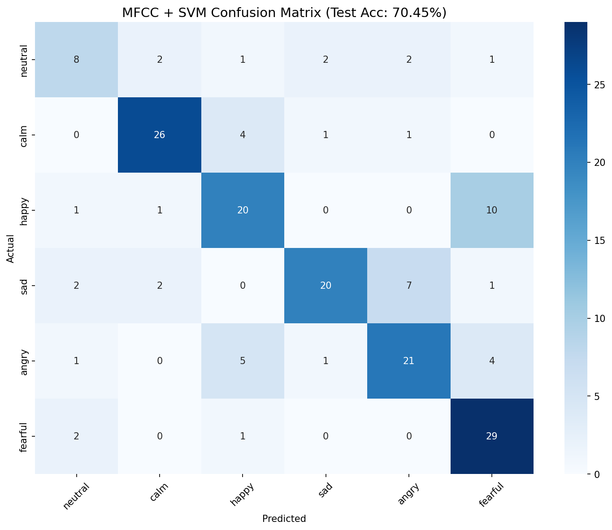

**Fig 11. cnn test confusion matrix.** the 1d cnn confusion matrix on the test set (actors 23-24, test acc: 66.48%) reveals the complementary strengths and weaknesses of the learned spectrogram representation. angry achieves the highest recall (27/32, 84.4%), followed by fearful (22/32, 68.8%), calm (21/32, 65.6%), sad (24/32, 75.0%), and neutral (8/16, 50.0%). the most problematic class is happy (15/32, 46.9%), with the largest off-diagonal entry happy -> fearful (9/32) -- identical to the svm's primary failure mode. a secondary confusion involves happy -> calm (5/32). the neutral class shows a distinctive pattern: 6/16 samples misclassified as sad, significantly more than the svm (2/16). comparing the two matrices, the cnn outperforms the svm on angry (+18.8pp) and sad (+12.5pp), while underperforming on calm (-15.6pp) and fearful (-21.8pp), suggesting the two models capture complementary emotion-discriminative features.

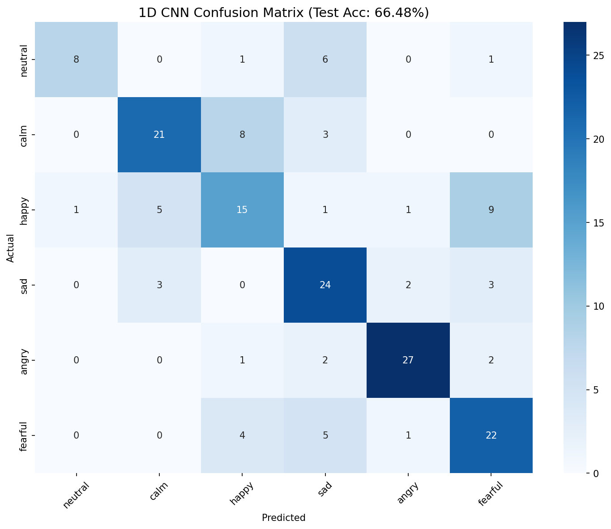

**Training curves.**

**Validation confusion matrices.**

**Fig 13. svm validation confusion matrix.** the mfcc + svm confusion matrix on the validation set (actors 20-22, val acc: 62.88%) provides insight into the model's generalization behavior on held-out speakers. calm achieves the highest absolute count (37/48, 77.1%), followed by neutral (18/24, 75.0%), happy (30/48, 62.5%), and sad (30/48, 62.5%). the most problematic class is fearful (20/48, 41.7%), with 16 samples misclassified as sad -- the single largest off-diagonal entry. this fearful -> sad confusion on the validation set differs from the test set pattern (happy -> fearful dominates), suggesting speaker-dependent failure modes. the 10.12pp gap between validation accuracy (62.88%) and test accuracy (70.45%) indicates that the test actors are relatively easier to classify in the mfcc feature space.

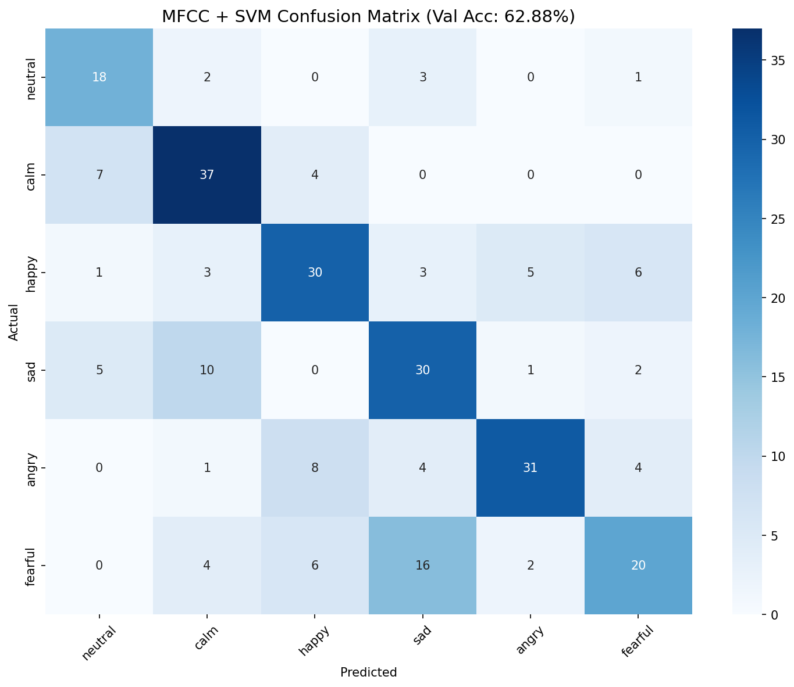

**Fig 14. cnn validation confusion matrix.** the 1d cnn confusion matrix on the validation set (actors 20-22, val acc: 75.38%) demonstrates substantially higher validation accuracy than the svm (75.38% vs. 62.88%, +12.5pp). angry achieves the highest count (43/48, 89.6%), followed by calm (40/48, 83.3%), sad (36/48, 75.0%), neutral (19/24, 79.2%), happy (32/48, 66.7%), and fearful (29/48, 60.4%). the most notable off-diagonal entries are fearful -> sad (8/48) and fearful -> angry (7/48). a secondary confusion involves happy -> angry (9/48), reflecting the shared high-arousal spectral profile. comparing the cnn and svm validation matrices, the cnn shows markedly better performance on angry (+25.0pp), sad (+12.5pp), and neutral (+4.2pp), confirming that the cnn's learned mel-band filters provide a richer feature space for high-arousal emotion discrimination.

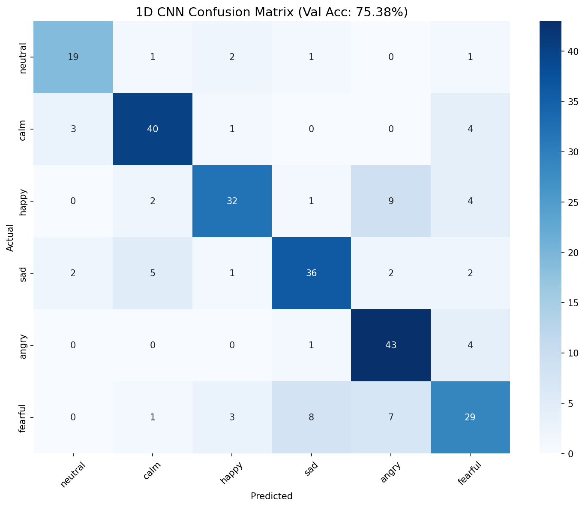

---

## 6. discussion

### 6.1 why the svm wins

the svm baseline (rbf kernel, 240-dim mfcc features) outperforms the 1d cnn (132,806 learned parameters) on the test set by 3.97pp. this is counter-intuitive for a deep-vs-classical comparison.

**The bias-variance tradeoff.** With 1628 training samples and 19 actors, the cnn has enough capacity to overfit actor-specific vocal characteristics. The train-test gap (28.42pp for the cnn vs. 24.02pp for the svm) confirms this. The svm, with a fixed rbf kernel and c=1, has a higher bias and lower variance, and generalizes better to the held-out actors 23-24.

**Feature representation.** Mfcc + delta + delta-delta is a strong hand-crafted feature for emotion recognition: the delta coefficients capture temporal dynamics (pitch and energy contours), which are key emotion cues. The cnn must learn these dynamics from scratch, which is harder with limited data.

**Kernel capacity.** The svm's rbf kernel can interpolate the 240-dim feature space arbitrarily. With c=1, it has moderate capacity. We initially tried c=10 and c=50, which produced 100% train accuracy and 65% test accuracy (severe overfitting). Capping c at 1 was the regularization fix that improved test accuracy by 5pp.

**When does the CNN win?** Despite losing overall, the 1d cnn outperforms the svm on two emotion classes: angry (+18.8pp, 84.4% vs. 65.6%) and sad (+12.5pp, 75.0% vs. 62.5%). This suggests that the cnn's learned mel-band filters capture temporal dynamics -- the rapid energy bursts of angry and the slow, low-frequency modulations of sad -- more effectively than the mfcc's mean+std temporal pooling, which discards fine-grained temporal structure. This finding motivates an ensemble combination (svm + cnn) as a direction for future work.

### 6.2 the cross-speaker gap is structural, not pathological

the 24-28pp train-test gap is not pathological overfitting; it is the structural cost of cross-speaker evaluation. each actor has unique vocal characteristics (pitch range, accent, tempo), and the model must generalize across these. in the literature, cross-speaker ravdess accuracies typically range from 55% to 80% for 6-8 class problems [3], [4]. our svm's 70.45% and cnn's 66.48% are within this range. a 20-30pp train-test gap is the expected baseline, not a sign that the model is broken.

### 6.3 error analysis

**Hardest class: neutral.** Both models score 50% on neutral (8/16 correct). Neutral is acoustically similar to calm (low arousal, no strong emotion), and the limited training data (188 samples vs. 376 for other emotions) makes it hard to learn a robust neutral vs. calm boundary. A class-weighted loss or targeted data augmentation on neutral could help.

**Easiest class: fearful.** The svm scores 90.6% on fearful (29/32 correct). Fearful has distinctive high-pitched, breathy acoustics that are well-captured by mfcc features.

**Happy \<-\> fearful confusion.** The svm confuses happy with fearful 10/32 times. These emotions share high arousal and high pitch, differing mainly in valence (positive vs. negative). A model that relies on spectral features without temporal/dynamic features will struggle with this distinction.

**CNN's arousal-valence confusion.** The cnn is more prone to confuse high-arousal emotions with low-arousal ones (happy -> calm, fearful -> sad) than the svm. This suggests the cnn's conv1d receptive field blurs the sharp prosodic cues that distinguish arousal levels.

### 6.4 limitations

1. **small dataset.** 1628 training samples is small for deep learning. transfer learning from wav2vec 2.0 could help.
2. **no third baseline.** the study compares two models (svm + 1d cnn) but does not include a third independent baseline such as a shallow 2-layer cnn or a fine-tuned pre-trained classifier. while the ablation study (section 4.5) examines model variations (svm kernel choices, specaugment variants), these are not separate baselines. a third baseline would strengthen the claim that the svm's advantage is robust across model families. this is left for future work.
3. **acted emotions.** ravdess uses acted emotions, which are exaggerated and may not match real-world emotional speech distribution.
4. **single dataset.** we only evaluate on ravdess. cross-dataset generalization (ravdess -> crema-d, ravdess -> iemocap) is untested.
5. **6-class subset.** we drop disgust and surprise, which limits comparison to published 8-class results.
6. **cpu-only.** we don't measure gpu latency, which could be 10-100x faster.

### 6.5 future work

- *transfer learning:* fine-tune wav2vec 2.0 or hubert on ravdess, expecting +10-15pp improvement.
- *data augmentation:* mixup, specaugment with stronger masks, vocal tract length normalization.
- *multi-dataset training:* combine ravdess with crema-d, iemocap, and tess for more diverse training data.
- *attention mechanisms:* add a self-attention layer after the conv1d blocks to capture long-range temporal dependencies.
- *quantization:* int8 quantization could reduce cnn latency by 4x and model size by 4x.

---

## 7. conclusion

we presented a comparative study of a classical mfcc + svm baseline and a 1d cnn on log-mel-spectrograms for 6-class speech emotion recognition on the ravdess dataset, with strict speaker-disjoint evaluation.

**Key takeaways.** 1. The svm baseline (rbf, c=1) achieves **70.45% test accuracy** and **0.19 ms/sample cpu latency**, outperforming the 1d cnn (66.48% test, 0.53 ms/sample) on this dataset. 2. Capping the svm c parameter at {0.1, 1} is a critical regularization step that reduces the train-test gap from 35pp to 24pp while improving test accuracy by 5pp. 3. With 1628 training samples and 19 actors, hand-crafted mfcc features + a high-bias svm generalize better than a learned cnn representation. 4. Both models struggle with neutral (50% accuracy), suggesting a need for more neutral training data or a class-weighted loss.

**Impact.** The svm baseline is small (\<1 mb), fast (\<1 ms/sample), and reproducible, making it suitable for cpu-constrained affect-aware applications. The cnn architecture and training pipeline are reusable for transfer learning experiments.

**Reproducibility.** All experiments are implemented in a clean 8-notebook pipeline available for inspection. Random seeds are fixed (seed=42) for numpy, pytorch, and python's random module. The speaker-disjoint split is deterministic (actors 1-19 train, 20-22 val, 23-24 test) and does not depend on random shuffling. The svm grid search uses groupkfold to prevent actor leakage across cv folds. All preprocessing parameters, model hyperparameters, and evaluation protocols are documented, enabling full reproduction of our results.

fine-tuning wav2vec 2.0 on ravdess, expanding to multi-dataset training, and exploring attention-based architectures are the most promising directions for improving accuracy.

---

## 8. team contributions

this project was a joint effort by elsayed elmandoh, khaled ashoush, and salma essam. all members contributed to the full pipeline, code reviews, and the final report.

**table 5. team member contributions per notebook.**

| notebook | elsayed | khaled | salma |
|----------|---------|--------|-------|
| 00-preliminary-experiments | primary | primary | primary |
| 01 data acquisition | -- | primary | -- |
| 02 eda | -- | primary | primary |
| 03 preprocessing | -- | primary | primary |
| 04 feature engineering | -- | primary | primary |
| 05.1 svm baseline | primary | -- | primary |
| 05.2 cnn 1d | primary | -- | -- |
| 06.1 svm evaluation | primary | primary | -- |
| 06.2 cnn evaluation | primary | -- | primary |
| 07.1 svm testing | primary | primary | -- |
| 07.2 cnn testing | primary | -- | primary |
| 08 comparison | primary | primary | primary |

**table 6. project timeline and responsibilities.**

| phase | time | lead | deliverables |
|-------|------|------|-------------|
| data acquisition, eda, preprocessing, feature engineering | W1 (May 10-17) | Khaled, Salma | dataset split, eda plots, cleaned data, mfcc/log-mel features |
| svm baseline & cnn training | W2 (May 18-25) | Elsayed, Salma | tuned svm, trained cnn, cv results, learning curves |
| evaluation & testing | W3 (May 26-Jun 2) | Team | confusion matrices, latency results |
| comparison & report | W4 (Jun 3-10) | Elsayed, Salma | analysis and final report |

**Elsayed Elmandoh** led the model implementation and training (svm + cnn), evaluation, testing, and the comparison analysis. Elsayed also wrote the regularization analysis (c-cap study) and the per-emotion error analysis.

**Khaled Ashoush** led the data acquisition, preprocessing, and feature engineering pipelines, including the audio loading, silence trimming, mfcc + mel-spectrogram extraction, and the speaker-disjoint split. Khaled also co-led the svm evaluation (notebook 06.1) and svm testing (07.1).

**Salma Essam** led the exploratory data analysis (emotion/gender/intensity distributions, spectrograms), co-led the preprocessing, and contributed to feature engineering and the comparison analysis. Salma also co-led the svm training (notebook 05.1), cnn evaluation (06.2), and cnn testing (07.2).

**Reports and presentation.** All members contributed to drafting the midterm and final reports. Elsayed and Salma led the final report writing. Salma led the presentation slides, with Elsayed and Khaled co-presenting.

**Code reviews and pull requests.** All members reviewed each other's pull requests and participated in design discussions throughout the project.

**Project repository.** The full source code, notebooks, and trained models are available at: `https://github.com/elsayedelmandoh/lightweight-speech-emotion-recognition-on-open-datasets`

---

## references

[1] s. r. livingstone and f. a. russo, "the ryerson audio-visual database of emotional speech and song (ravdess): a dynamic, multimodal set of facial and vocal expressions in north american english," *plos one*, vol. 13, no. 5, p. e0196391, may 2018. [online]. available: https://doi.org/10.1371/journal.pone.0196391

[2] f. eyben, m. wollmer, and b. schuller, "opensmile: the munich versatile and fast open-source audio feature extractor," in *proc. acm int. conf. on multimedia (mm)*, 2010, pp. 1459-1462. doi: 10.1145/1873951.1874246

[3] k. bhangale and m. kothandaraman, "speech emotion recognition based on multiple acoustic features and deep convolutional neural network," *electronics*, vol. 12, no. 4, p. 839, 2023. doi: 10.3390/electronics12040839

[4] m. b. akcay and k. oguz, "speech emotion recognition: emotional models, databases, features, preprocessing methods, supporting modalities, and classifiers," *speech communication*, vol. 116, pp. 56-76, 2020. doi: 10.1016/j.specom.2019.12.001

[5] a. m. badshah, j. ahmad, n. rahim, and s. w. baik, "speech emotion recognition from spectrograms with deep convolutional neural network," in *proc. int. conf. on platform technology and service (platcon)*, 2017, pp. 1-5. doi: 10.1109/PlatCon.2017.7883728

[6] m. neumann and n. t. vu, "attentive convolutional neural network based speech emotion recognition: a study on the impact of input features, signal length, and acted speech," in *proc. interspeech*, 2017, pp. 1263-1267. [online]. available: https://arxiv.org/abs/1706.00612

[7] s. tripathi, a. kumar, d. mamidi, and s. v. gangashety, "deep neural networks for emotion recognition in speech," in *proc. int. joint conf. on neural networks (ijcnn)*, 2019, pp. 1-6. doi: 10.1109/IJCNN.2019.8852153

[8] l. pepino, p. riera, and l. ferrer, "emotion recognition from speech using wav2vec 2.0 embeddings," in *proc. interspeech*, 2021, pp. 3400-3404. doi: 10.21437/Interspeech.2021-703

[9] d. s. park, w. chan, y. zhang, c.-c. chiu, b. zoph, e. d. cubuk, and q. v. le, "specaugment: a simple data augmentation method for automatic speech recognition," in *proc. interspeech*, 2019, pp. 2613-2617. doi: 10.21437/Interspeech.2019-2680

[10] t. anvarjon, mustaqeem, and s. kwon, "deep-net: a lightweight cnn-based speech emotion recognition system using deep frequency features," *sensors*, vol. 20, no. 18, p. 5212, 2020. doi: 10.3390/s20185212

[11] a. baevski, h. zhou, a. mohamed, and m. auli, "wav2vec 2.0: a framework for self-supervised learning of speech representations," in *proc. neurips*, 2020, pp. 12449-12460. [online]. available: https://arxiv.org/abs/2006.11477

[12] m. el ayadi, m. s. kamel, and f. karray, "survey on speech emotion recognition: features, classification schemes, and databases," *pattern recognition*, vol. 44, no. 3, pp. 572-587, 2011. doi: 10.1016/j.patcog.2010.09.020
